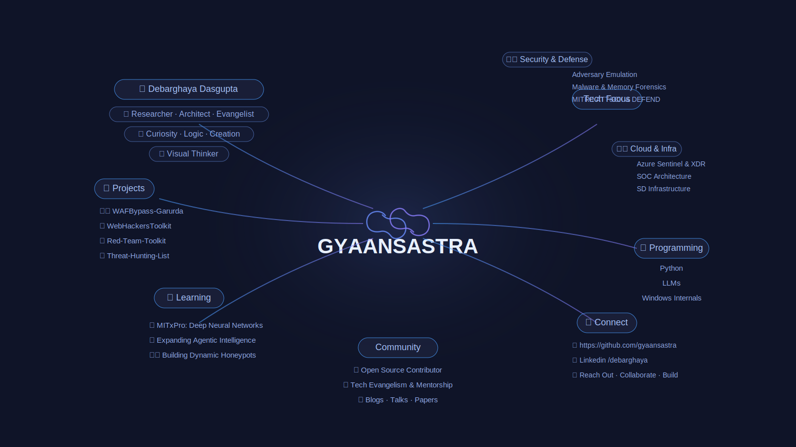
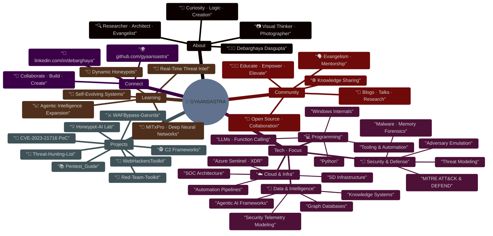

<h1 align="center">🧠 GYAANSASTRA</h1>
<p align="center">
  <i>Where Curiosity Meets Cognition · Code that Thinks · Systems that Learn</i><br>
  <a href="https://github.com/gyaansastra"><b>@gyaansastra</b></a>
</p>

<p align="center">
  
</p>

---

## 🌌 Innovation Manifesto

> **Code is not just logic — it's language.**  
> It speaks to machines, but whispers to minds.  
>
> I explore the unseen intersections of:
>
> * 🧠 **Cognition** → Human-like reasoning
> * ⚔️ **Defense** → Cyber resilience & deception
> * 🧩 **Systems** → AI frameworks that evolve
> * 🔥 **Creation** → Transforming ideas into impact

---

## ⚡ Interactive Knowledge Map

<details open>
<summary><b>🗺️ Click to explore my technical universe</b></summary>


```mermaid
%%{init: {'theme':'dark', 'themeVariables': { 'primaryColor':'#1f2937', 'primaryTextColor':'#e5e7eb', 'primaryBorderColor':'#60a5fa', 'lineColor':'#60a5fa', 'secondaryColor':'#374151', 'tertiaryColor':'#1f2937', 'background':'#111827', 'mainBkg':'#1f2937', 'secondBkg':'#374151', 'tertiaryBkg':'#111827'}}}%%
mindmap
  root((🧠 GYAANSASTRA))
    About
      "👨‍💻 Debarghaya Dasgupta"
      "🔍 Researcher · Architect · Evangelist"
      "💬 Curiosity · Logic · Creation"
      "📷 Visual Thinker · Photographer"
    Tech · Focus
      "🧱 Security & Defense"
        "Adversary Emulation"
        "Malware · Memory Forensics"
        "Threat Modeling"
        "MITRE ATT&CK & DEFEND"
      "☁️ Cloud & Infra"
        "Azure Sentinel · XDR"
        "SOC Architecture"
        "Automation Pipelines"
        "SD Infrastructure"
      "🧮 Data & Intelligence"
        "Graph Databases"
        "Knowledge Systems"
        "Security Telemetry Modeling"
        "Agentic AI Frameworks"
      "💻 Programming"
        "Python"
        "LLMs · Function Calling"
        "Windows Internals"
        "Tooling & Automation"
    Projects
      "⚔️ WAFBypass-Garurda"
      "🧰 WebHackersToolkit"
      "🎯 Red-Team-Toolkit"
      "🔎 Threat-Hunting-List"
      "📚 Pentest_Guide"
      "🚨 CVE-2023-21716 PoC"
      "🕵️ C2 Frameworks"
      "💡 Honeypot-AI Lab"
    Learning
      "📘 MITxPro · Deep Neural Networks"
      "📈 Agentic Intelligence Expansion"
      "🧬 Dynamic Honeypots"
      "📡 Real-Time Threat Intel"
      "🧭 Self-Evolving Systems"
    Community
      "🤝 Open Source · Collaboration"
      "🗣 Evangelism · Mentorship"
      "📓 Blogs · Talks · Research"
      "🌐 Knowledge Sharing"
      "🧑‍🏫 Educate · Empower · Elevate"
    Connect
      "🌍 github.com/gyaansastra"
      "🔗 linkedin.com/in/debarghaya"
      "💌 Collaborate · Build · Create"
```

</details>

---

## 🚀 Featured Work

| Domain             | Repository                                                                | Description                                  |
| :----------------- | :------------------------------------------------------------------------ | :------------------------------------------- |
| Offensive Research | [WAFBypass-Garurda](https://github.com/gyaansastra/WafBypass-garurda)     | WAF evasion and obfuscation engine           |
| AI Memory          | [Mastishka](https://github.com/gyaansastra/mastihka)                      | Comprehensive Agentic Memory Framework       |
| 1-Day Prediction   | [Bhavishya](https://github.com/gyaansastra/bhavishya)                     | 1-Day Vulnerability Prediction using RNN     |
| Security Education | [Pentest_Guide](https://github.com/gyaansastra/Pentest_Guide)             | Structured guide for learners                |
| Advanced PoC       | [CVE-2023-21716](https://github.com/gyaansastra/CVE-2023-21716)           | Windows exploit PoC research                 |
| AI + Security      | [Honeypot-AI](https://github.com/gyaansastra/Honeypot-AI)                 | Dynamic LLM-powered deception lab            |

---

## 💡 Active Projects & Research

<table>
<tr>
<td width="50%">

### 🔬 Current Focus
- 🧬 **Dynamic Honeypots** - Self-adapting deception
- 🤖 **Agentic AI** - Autonomous security frameworks
- 📡 **Threat Intel** - Real-time analysis systems
- 🛡️ **Memory Forensics** - Advanced malware analysis

</td>
<td width="50%">

### 📚 Learning Path
- 🎓 MITxPro Deep Neural Networks
- 🧠 Cognitive Security Systems
- ⚡ Adversarial Machine Learning
- 🔮 Predictive Threat Modeling

</td>
</tr>
</table>

---

## 🛠️ Technical Arsenal

<details>
<summary><b>🔐 Security & Defense Expertise</b></summary>

```yaml
Offensive Security:
  - Adversary Emulation & Red Teaming
  - Advanced Persistence Techniques
  - Memory Exploitation & Forensics
  - WAF Bypass & Evasion

Defensive Strategies:
  - MITRE ATT&CK Framework Implementation
  - Threat Hunting & Intelligence
  - Incident Response Automation
  - Deception Technology & Honeypots
```

</details>

<details>
<summary><b>☁️ Cloud & Infrastructure</b></summary>

```yaml
Cloud Platforms:
  - Azure Sentinel & Security Center
  - AWS Security Hub & GuardDuty
  - Multi-Cloud SOC Architecture
  
Infrastructure:
  - Zero Trust Network Design
  - SD-WAN Security
  - Container Security (K8s)
  - IaC Security Automation
```

</details>

<details>
<summary><b>🤖 AI & Intelligence Systems</b></summary>

```yaml
AI/ML Security:
  - LLM Security & Jailbreaking
  - Adversarial AI Research
  - Behavioral Analytics
  - Predictive Threat Modeling

Data Engineering:
  - Graph Databases (Neo4j)
  - Security Data Lakes
  - SIEM/SOAR Integration
  - Telemetry Processing Pipelines
```

</details>

---

## 🌐 Community Engagement

## 📊 Live GitHub Metrics

<!-- METRICS-START -->
📅 
⚡ 
💻 

### 🎯 Current Status: 💪 Active Contributor

<table>
<tr>
<td>

**📈 Repository Stats**
- Total Repositories: **101**
- Original Projects: **98**
- Total Stars: ⭐ **107**
- Total Forks: 🍴 **20**

</td>
<td>

**🔥 Developer Activity**
- Total Commits: **301**
- PRs Merged: **53**
- Issues Closed: **0**
- Commits (30d): **23**

</td>
</tr>
</table>

### 💻 Top Languages
- **Python**: █████████ `33 repos`
- **JavaScript**: █ `7 repos`
- **TypeScript**: █ `5 repos`
- **Jupyter Notebook**: █ `5 repos`
- **C**: █ `4 repos`

### 🏆 Earned Badges
 

### 📌 Top Public Repositories
- [CVE-2023-21716](https://github.com/gyaansastra/CVE-2023-21716) - ⭐ **59** stars
- [Print-Nightmare-LPE](https://github.com/gyaansastra/Print-Nightmare-LPE) - ⭐ **20** stars
- [Threat-Hunting-List](https://github.com/gyaansastra/Threat-Hunting-List) - ⭐ **9** stars
- [CVE-2022-0847](https://github.com/gyaansastra/CVE-2022-0847) - ⭐ **3** stars
- [AmOgh](https://github.com/gyaansastra/AmOgh) - ⭐ **2** stars
<!-- METRICS-END -->

### 🤝 Collaboration Principles
- **Open Source First** - Building in public, sharing knowledge freely
- **Mentor & Elevate** - Lifting others as we climb
- **Research & Share** - Publishing findings for community benefit
- **Continuous Learning** - Student mindset, always evolving

---

## 🧬 Vision 2035

> **"A world where systems defend, learn, and evolve — autonomously."**  
> 
> Building *Agentic AI Frameworks* and *Hyper-Realistic Honeypots* that transform cyber defense into living intelligence.

### 🎯 Milestones
- **2025** → Launch autonomous honeypot framework
- **2027** → Cognitive threat prediction system
- **2030** → Self-healing security infrastructure
- **2035** → Fully autonomous cyber defense ecosystem

---

## 📬 Let's Connect & Collaborate

<p align="center">
  <a href="https://github.com/gyaansastra">
    
  </a>
  <a href="https://linkedin.com/in/debarghayadasgupta">
    
  </a>
  <a href="https://twitter.com/gyaansastra">
    
  </a>
</p>

---

<p align="center">
  
</p>

<p align="center">
  <i>Crafted with precision · Powered by purpose · Driven by curiosity</i>
  <br><br>
  <b>— Debarghaya Dasgupta (@gyaansastra)</b>
</p>
